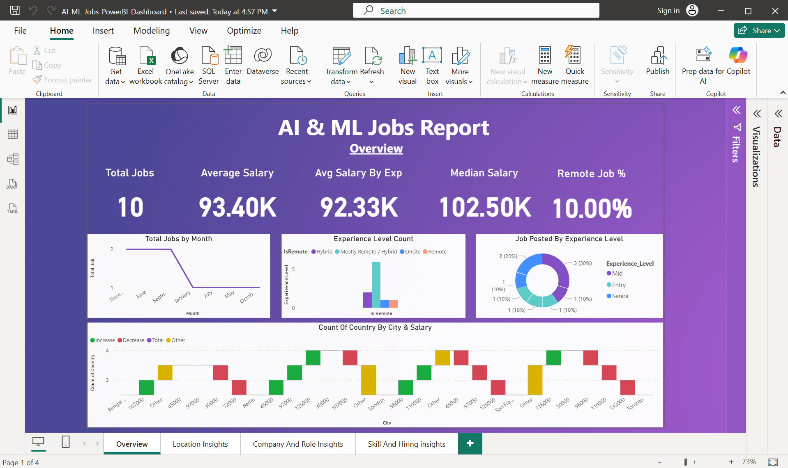
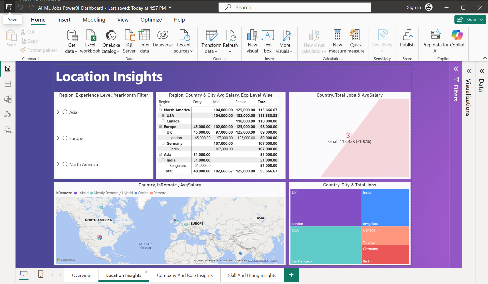
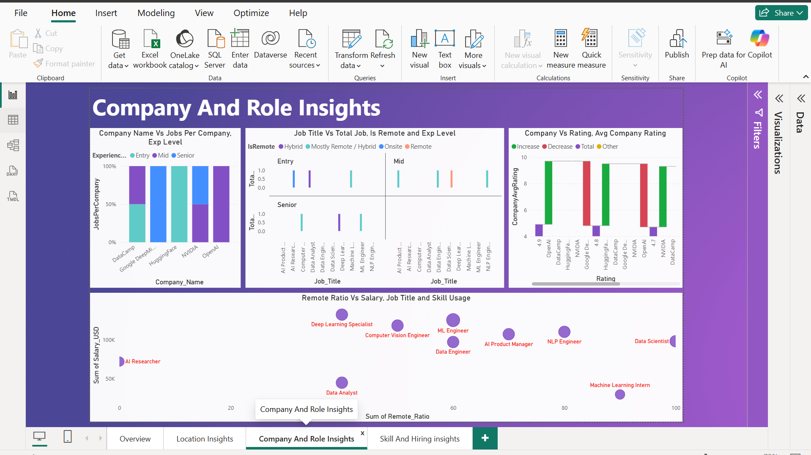
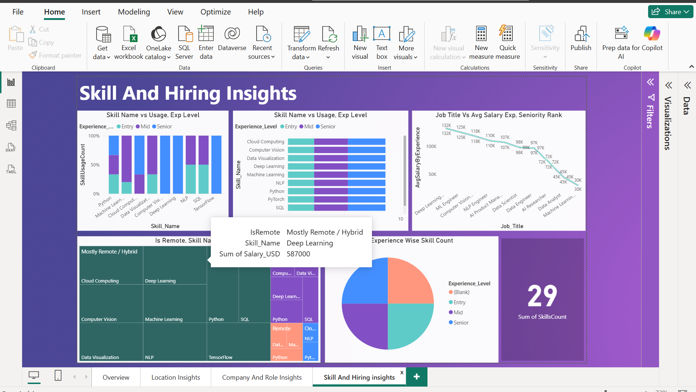

# AI & ML Jobs Analytics Dashboard

## Project Overview
This is my first Power BI dashboard project created to analyze AI and Machine Learning job market trends.

## Tools Used
- Power BI
- Excel / CSV
- DAX
- Data Visualization

## Dashboard Features
- Total Jobs Analysis
- Average Salary Analysis
- Median Salary Analysis
- Remote Job Insights
- Experience Level Analysis
- Location Insights
- Skills & Hiring Insights

## Dashboard Pages
1. Overview
2. Location Insights
3. Company & Role Insights
4. Skill & Hiring Insights

## Key Learnings
- Creating KPI cards
- Building interactive dashboards
- Working with DAX measures
- Designing multi-page reports
- Data visualization best practices

## Screenshots

### Overview

### Location Insights

### Company & Role Insights

### Skill & Hiring Insights
